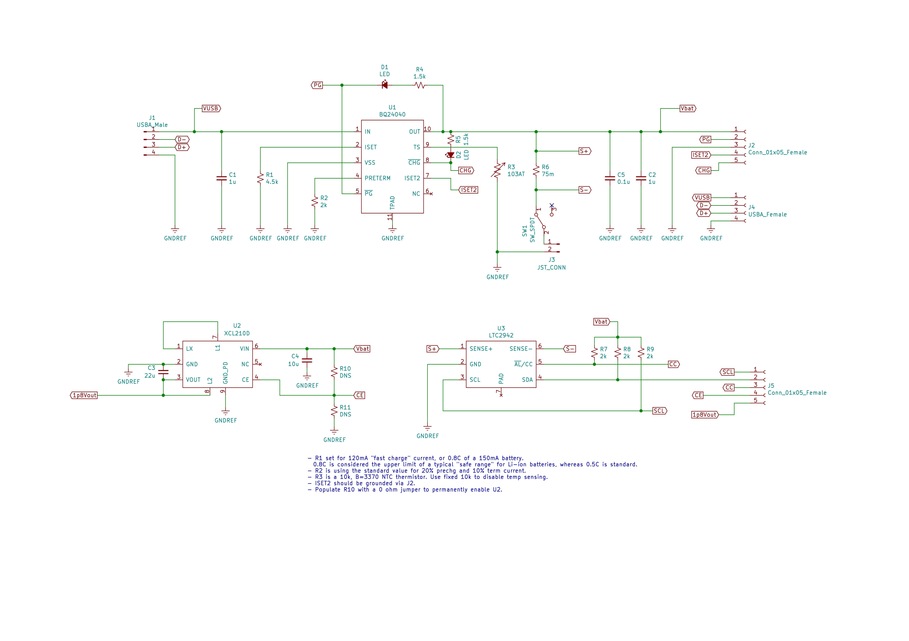
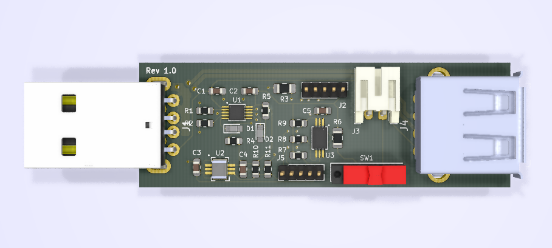
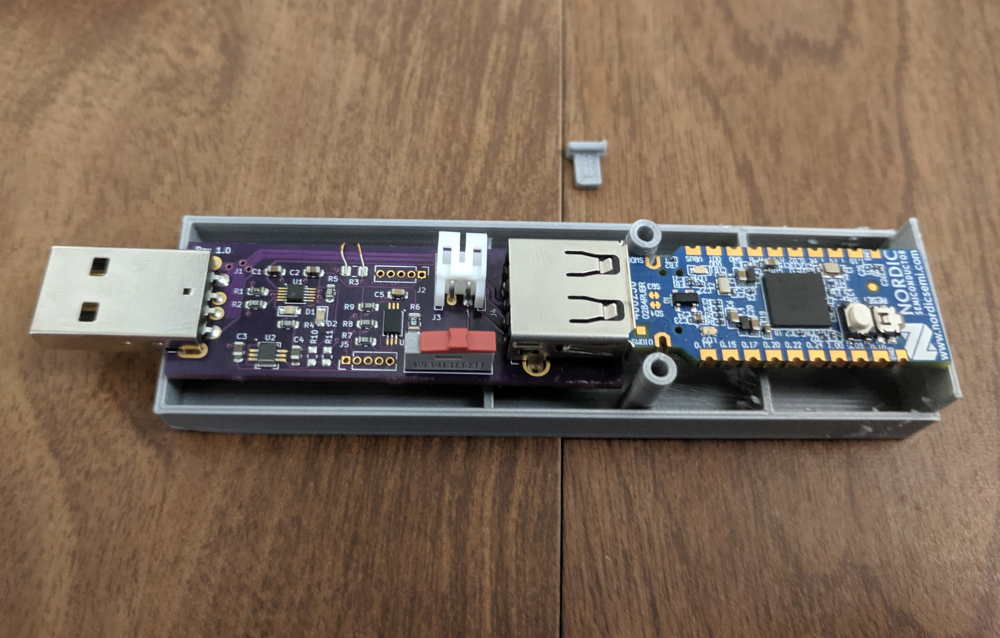

# nRF52830-Dongle_Charger_Prototype
Li-Ion test circuitry for an nRF52830-Dongle board

## Details
- Supplies battery power to nRF52840-Dongle when USB power is unavailable.
- Physical disconnect switch for battery.
- I2C Coulumb counter to monitor charge state
- 1.8V Voltage regulator for future ICs

